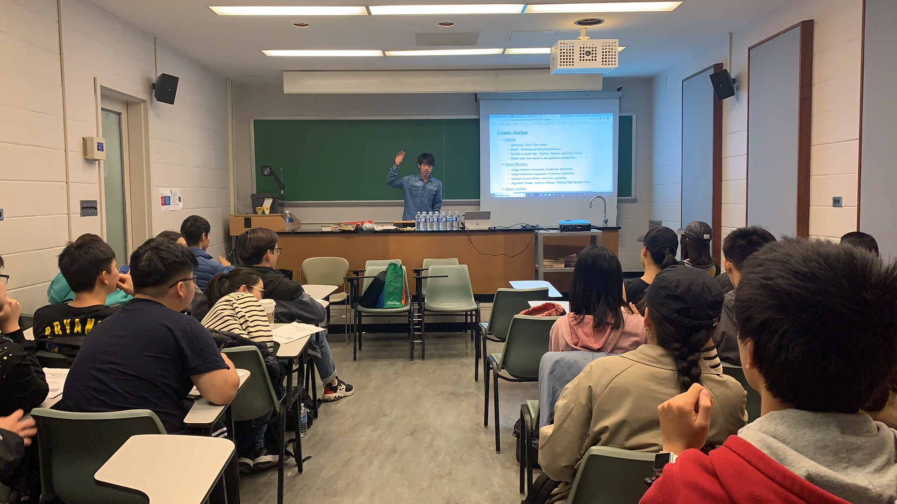
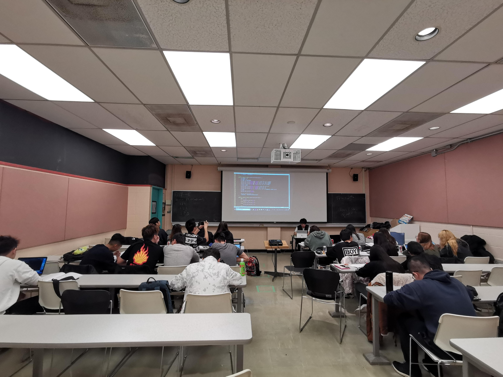
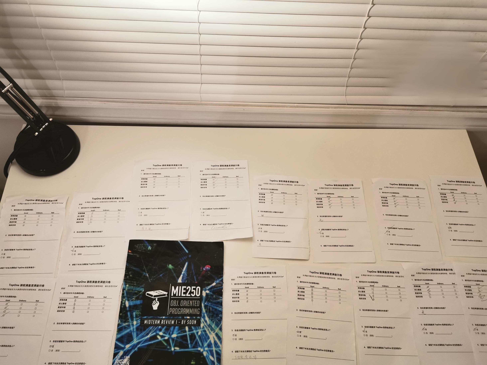
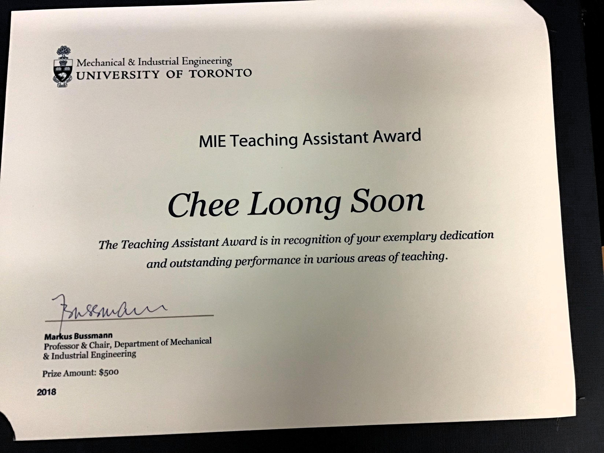

# Tutor

I teach on-line using:
* Online Whiteboard: https://awwapp.com/
* Video Call + Screen Share: https://hangouts.google.com/

Courses I cover: 
* Mathematics
  * Linear Algebra
  * Probability

* Computer Science
  * Algorithms & Data Structures
  * Software Interviews
  * Operating Systems
  * Object-Oriented Programming

* Computer Engineering
  * Digital Systems
  * Computer Organization

* Artificial Intelligence
  * Machine Learning
  * Information Retrieval
  * Recommender Systems

